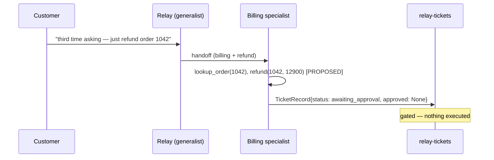

# Module 8 lab — multi-agent systems and Bedrock AgentCore: Runtime, Memory, and HITL

> **This lab cost me about $0.02 on June 2026 prices** (well under the syllabus budget of
> < $2 for Module 8). Every token figure below is read from the API response, never
> guessed. The spend is a handful of **Amazon Nova 2 Lite** (smart-tier) agent runs — and
> a handoff makes each refund ticket **two reasoning loops** (the generalist routes, the
> Billing specialist resolves), so a refund ticket is the most expensive path. **Bedrock
> AgentCore Runtime** bills per second of active consumption and is **free when idle**;
> **AgentCore Memory** short-term events cost cents, and the **long-term store is the only
> idle-billed item** (~$0.75 / 1K records / month — purged at teardown). Measured
> breakdown (real run, 13 Jun 2026, account 901353600690, us-east-1):
>
> | Item | Real usage observed | Cost |
> |---|---|---|
> | refund handoff runs (generalist routes + Billing specialist resolves, ~4 runs × 3 model calls) | ~5,500 in / ~300 out per run | ~$0.0096 |
> | non-refund generalist run (single agent) | ~3,500 in / ~200 out | ~$0.0016 |
> | inherited live smoke (fast/smart/KB-RAG/vision/Titan/M7-agent) | small | ~$0.0034 |
> | M8 live handoff smoke (smart-tier refund propose) | ~5,500 in / ~300 out | ~$0.0024 |
> | AgentCore Memory (short-term session events + a few long-term records) | ~10 events | ~$0.002 |
> | AgentCore Runtime (idle FREE — no active vCPU billed this session) | none active | $0.000 |
> | DynamoDB on-demand (orders seed + ticket writes + refund execution) | a few hundred tiny ops | <$0.001 |
> | MCP Lambda (deploy + invocations) + Function URL | cold + warm starts | <$0.001 |
> | **Total (measured)** | | **≈ $0.02** |
>
> Note on the live run in this account: the Lambda **Function URL** for the CloudCart MCP
> server was blocked by an account/org guardrail (`AccessDeniedException` on
> `lambda:InvokeFunctionUrl`, even signed). The MCP server is the same code either way, so
> the run used the documented dev path — a local MCP server reached via
> `RELAY_MCP_URL=http://127.0.0.1:8000/mcp` (`uv run python -m mcp_server`), which still
> does real DynamoDB I/O against `relay-orders` / `relay-tickets`. The agent reasoning
> (Nova 2 Lite), the handoff, the HITL gate, and AgentCore Memory all ran live; only the
> tool-server network hop was local. The **AgentCore Runtime** itself is launched by the
> external `agentcore` CLI (a Docker build + ECR push) — out of reach in a CLI-less
> sandbox, and it bills $0 idle, so it has no cost or teardown impact.
>
> Nova 2 Lite is ~$0.30 in / ~$2.50 out per million tokens; AgentCore Runtime is
> ~$0.0895 / vCPU-hour, idle free; long-term Memory ~$0.75 / 1K records / month (ALL **as
> of June 2026** — re-verify on the [Bedrock pricing page](https://aws.amazon.com/bedrock/pricing/)).
>
> - **Only one idle-billed item, and it is purged.** AgentCore long-term **Memory** is the
>   single resource that bills while nothing runs; `teardown.py` deletes it. AgentCore
>   **Runtime** is free idle; DynamoDB `relay-orders` / `relay-tickets` are **on-demand**
>   (~$0 idle); the MCP **Lambda** and the inherited KB + S3 Vectors are ~$0 idle.
>
> **Teardown reminder:** run `uv run python teardown.py` when you're done. It **purges the
> AgentCore Memory** (the only idle-billed item) and removes the MCP Lambda + role, while
> **keeping** the on-demand tables and the Knowledge Base (Module 9+ reuse them, ~$0 idle).
> Then remove the runtime with `agentcore destroy` (idle was already free). Add
> `--delete-tables` / `--delete-kb` for a clean slate. The M1 $5 budget stays.

**Goal:** deploy the Module 7 Strands agent on **Bedrock AgentCore Runtime** with
persistent **memory**, add a **Billing specialist** reached by **handoff**, and gate the
sensitive **refund** action behind a **human-in-the-loop** approval — a refund proposes an
`AgentAction(approved=None)` and parks the `TicketRecord` in `awaiting_approval` instead of
executing it blindly.

Region for the whole course: **us-east-1**. Profile: `AWS_PROFILE=aws-genai-pro`. No AWS
key in code or `.env`.

---

## Step 1 — Carry the cumulative state forward

Module 8 starts from Module 7's `relay/` package byte-for-byte (`models.py`, `config.py`,
`llm.py`, `triage.py`, `kb.py`, `intake.py`, `tools.py`, `agent.py`) plus the inherited
`ingest/` pipeline, the `mcp_server/` package, the DynamoDB tables `relay-orders` /
`relay-tickets`, and the **Module 5 Knowledge Base `relay-kb`**. If the Module 7 agent does
not run (tables/KB/MCP Lambda missing), run `uv run python setup.py` first.

```bash
uv sync   # adds bedrock-agentcore~=1.14 alongside strands-agents~=1.43, mcp~=1.27
aws sts get-caller-identity   # the account the bucket name is suffixed with
```

> **Pins (re-verified on generation day, 13 Jun 2026):** `bedrock-agentcore` latest
> **1.14.1** → pinned `~=1.14`; `strands-agents` latest **1.43.0** → `~=1.43`; `mcp`
> **1.27.2** → `~=1.27`. **Bedrock AgentCore is GA** (since 13 Oct 2025). The deployment
> tool is the standalone **`agentcore` CLI** (`github.com/aws/agentcore-cli`) — installed
> outside these Python deps, like the AWS CLI; **not** the legacy starter toolkit. Strands
> and AgentCore move fast — re-verify on PyPI when you run the lab; `uv.lock` is committed.

---

## Step 2 — The Billing specialist (`relay/specialists.py`)

A single well-tooled agent usually beats a swarm — every extra agent costs a model turn
(latency), duplicated context (tokens), and debugging surface (complexity). You add one
only when the **specialization is justified**. A **refund** is that case: it needs a
different tone, its own rules, and a guard rail (propose, never execute blindly).

`relay/specialists.py` defines the **Billing specialist** (the canonical name, 06 §5.4 —
no synonym): a second **Strands** agent with its own refund-tone system prompt and a
`refund` tool. The `refund` tool **proposes** a refund — it returns a structured proposal,
it moves no money:

```python
@tool
def refund(order_id: str, amount_cents: int, reason: str) -> str:
    """Propose a refund for a CloudCart order. This does NOT move money. ..."""
    # returns "Refund PROPOSED and submitted for human approval (not yet executed): {...}"
```

It runs on the **smart** tier (resolved through `relay.config` — no model ID in the file)
and shares the generalist's CloudCart tools (`lookup_order`, `create_ticket`) and the same
`AgentAction` journal, so the handoff produces **one** audit trail.

---

## Step 3 — The handoff and the HITL gate (`relay/agent.py`)

`relay/agent.py` is **extended by addition** (the Module 7 agent is untouched). Two new
capabilities:

1. **Handoff** (`handle_with_handoff`): when a ticket is a refund case
   (`is_refund_request` — triage `billing` **and** refund-shaped wording), Relay routes it
   to the Billing specialist. Otherwise it stays with the generalist. You only pay for a
   handoff you actually need.
2. **HITL gate** (`gate_sensitive_actions`): only the **sensitive** action (refund,
   `config.is_sensitive_tool`) is gated. A proposed `refund` keeps `approved=None`
   (awaiting a human); other actions are marked done. When a refund is parked, the
   `TicketRecord` status becomes **`awaiting_approval`** (the frozen status, exercised here
   for the first time) and the record is persisted **without executing** the refund.



---

## Step 4 — The human decision (`relay/approve.py`)

`relay/approve.py` is the **local/programmatic** approval (the public endpoint and the
event bus are Module 11). `approve(ticket_id, decision)` reads the `awaiting_approval`
record, sets `AgentAction.approved`, then:

- **approve** → executes the refund (a logged, idempotent state change on the order book),
  appends an execution action, status → **`answered`**;
- **reject** → `escalated = True`, status → **`escalated`** (no money moved).

```bash
uv run python -m relay.approve <ticket_id> --approve   # -> answered (refund executed)
uv run python -m relay.approve <ticket_id> --reject    # -> escalated
```

`approved` (frozen since M7) is now **effective**: `None` (proposed) → `True` (approved) /
`False` (rejected). No schema changed.

---

## Step 5 — Memory and deployment on AgentCore Runtime (`relay/run.py`, `agentcore/`)

`relay/run.py` is Relay's invocation entrypoint. `run_relay(payload) -> response` is the
**frozen invoke contract** (Module 11's worker reuses it, shape-for-shape):

```python
payload  = {"customer_message": str, "ticket_id": str|None, "triage_intent": str|None,
            "customer_id": str|None, "session_id": str|None}
response = {"ticket_id": str, "status": str, "answer_text": str,
            "handed_off": bool, "gated": bool, "record": dict}
```

It wires **AgentCore Memory**: **short-term** session events (a follow-up message in the
same session recalls the earlier one) and **long-term** cross-session records. We store
short, useful, **non-PII** facts in long-term memory — never the raw customer message (PII
redaction at intake is Module 10). Memory is best-effort: a memory outage degrades to a
stateless run, it never fails the ticket.

`setup.py` creates the AgentCore **Memory** store `relay-memory` and records its id in
`.memory_id`. The **Runtime** is launched with the `agentcore` CLI (idle free):

```bash
uv run python setup.py                                           # tables + MCP + Memory
agentcore configure --config-file agentcore/agentcore.yaml      # configure the runtime
agentcore launch                                                # deploy (microVM, idle FREE)
uv run python setup.py --record-runtime <arn-from-launch>       # record the runtime ARN
agentcore invoke '{"customer_message": "just refund order 1042", "customer_id": "dana", "session_id": "s1"}'
```

See `agentcore/README.md` for the full deploy flow.

---

## Step 6 — End-to-end demo

```bash
# 1. A refund ticket: handoff -> propose -> awaiting_approval (nothing executed).
uv run python -m relay.run "this is the third time I'm asking — just refund order 1042"
#   handed off: True -> the Billing specialist
#   gated     : True (refund awaiting human approval)
#   status    : awaiting_approval

# 2. A human approves -> the refund executes, status -> answered.
uv run python -m relay.approve <ticket_id> --approve

#    ...or rejects -> escalated (no money moved).
uv run python -m relay.approve <ticket_id> --reject

# 3. Memory: a second message in the same session recalls the first.
uv run python -m relay.run "did my refund go through?" --customer dana --session s1
```

---

## Step 7 — Tests

```bash
uv run pytest                              # 160 offline tests, no AWS calls (moto + Stubber)
RELAY_LIVE_TESTS=1 uv run pytest -m live   # opt-in, capped — up to 8 calls, ~$0.06
```

Offline, a refund ticket is driven by a **scripted model** (no Bedrock): it hands off, the
specialist proposes a refund as `AgentAction(approved=None)`, the `TicketRecord` parks in
`awaiting_approval`, and `relay.approve` drives approve → `answered` / reject → `escalated`
on a moto DynamoDB backend. The AgentCore Memory setup/teardown is driven by Stubbers.

---

## Try it yourself

1. **Add a Shipping specialist.** Mirror `relay/specialists.py` for shipping (its own tone
   + a `request_reshipment` tool), and route `triage.intent == "shipping"` to it in
   `handle_with_handoff`. Watch the routing follow the triage.
2. **Expire the session memory.** Run two messages in the same session, then start a new
   `--session` id (or let the short-term events expire) and ask the follow-up again — the
   agent no longer remembers the earlier conversation. That is short-term (session) memory
   vs long-term (cross-session) in action.

---

## Teardown

```bash
uv run python teardown.py        # PURGES AgentCore Memory (the only idle-billed item) +
                                 # removes the MCP Lambda/role; KEEPS tables + KB (Module 9+)
agentcore destroy                # removes the AgentCore Runtime (idle was free)
```

`teardown.py` is idempotent and prints what it removes. Add `--delete-tables` /
`--delete-kb` / `--delete-vectors` for a full clean slate. The M1 $5 budget stays — it
backstops the course.
